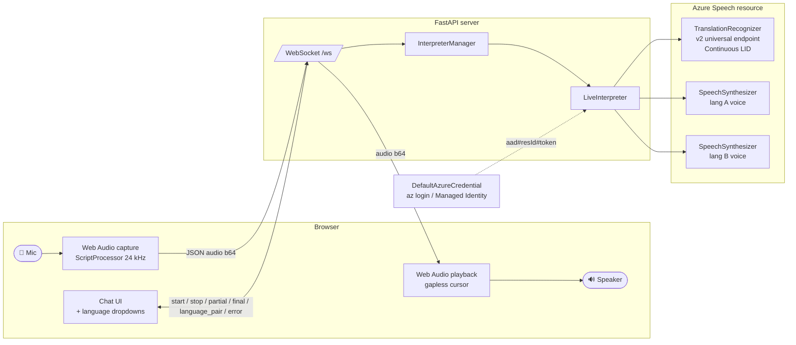
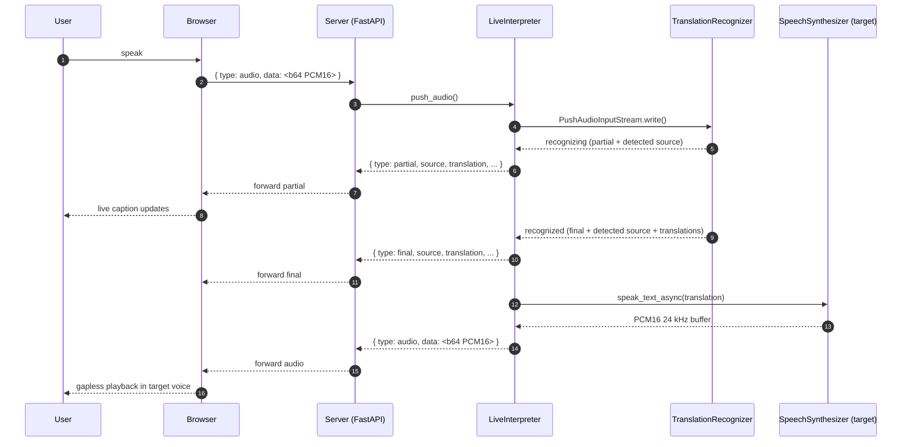
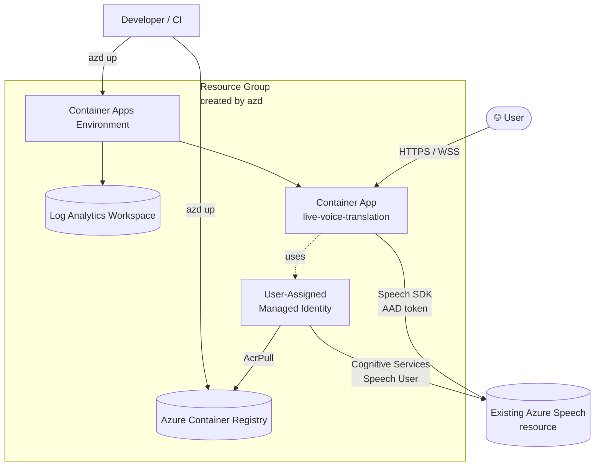

# Architecture

Diagrams covering the runtime data flow, the per-utterance sequence, and
the Azure deployment topology.

## Runtime components

## Per-utterance sequence

## Azure deployment topology

### Notes

- The Speech resource lives **outside** the resource group `azd` creates;
  the Bicep `role-assignment.bicep` module parses the subscription + RG
  from `AZURE_SPEECH_RESOURCE_ID` and grants the role at that scope.
- The Container App pulls the image from ACR via the managed identity
  (`AcrPull`) — no admin user / registry password is provisioned.
- All Speech traffic is AAD-authenticated; no Speech keys are stored.
