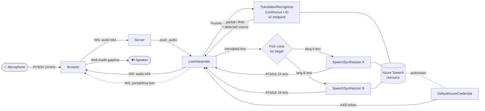

# Live Voice Translation

Real-time, bidirectional speech-to-speech interpreter built on the
[Azure Speech SDK](https://learn.microsoft.com/azure/ai-services/speech-service/)
(`TranslationRecognizer` + neural TTS). Pick a language pair, speak in either
language, and hear the translation in the other language's voice — both
directions, continuously, in a single session.

## How it works



- One `TranslationRecognizer` configured with both languages and
  `LanguageIdMode=Continuous` auto-detects the source per utterance via
  the Speech v2 universal endpoint.
- Two `SpeechSynthesizer` instances (one per language) render the translation
  in the appropriate neural voice.
- Authentication uses `DefaultAzureCredential` (Azure CLI locally, Managed
  Identity in Azure) — no keys.

See [ARCHITECTURE.md](ARCHITECTURE.md) for sequence and deployment diagrams.

## Prerequisites

- Python 3.10+
- An Azure **Speech** (or **AI Services / Cognitive Services**) resource
- Your local identity (and, in production, the container app's managed
  identity) granted the **Cognitive Services Speech User** role on the
  Speech resource
- For the CLI runner only: a working microphone/speaker and PortAudio
  (`pyaudio`)
- For Azure deployment: [Azure Developer CLI (azd)](https://learn.microsoft.com/azure/developer/azure-developer-cli/install-azd)
  and Docker

## Quick start (local)

```bash
git clone <repository-url>
cd live-voice-translation

python -m venv venv
# Windows:  venv\Scripts\activate
# macOS/Linux:  source venv/bin/activate

pip install -r requirements.txt

# Sign in so DefaultAzureCredential can mint Speech tokens
az login

# Configure the Speech resource
cp .env.example .env
# Edit .env and set AZURE_SPEECH_RESOURCE_ID + AZURE_SPEECH_REGION
```

Run the web app:

```bash
uvicorn server:app --reload
# Open http://localhost:8000
```

Or run the CLI:

```bash
python main.py --lang-a en-US --lang-b fr-FR
```

## Using the web UI

1. Pick **Language A** and **Language B** in the dropdowns.
2. Click **Start** and allow microphone access.
3. Speak in either language — the chat shows the live transcript and the
   translation, and the translated audio plays automatically in the other
   language's voice.
4. **Pause** / **Resume** / **Mute Mic** to control capture mid-session.

## Configuration

All configuration lives in `.env` (see [.env.example](.env.example)).

| Variable | Required | Description |
|----------|----------|-------------|
| `AZURE_SPEECH_RESOURCE_ID` | yes | Full ARM resource ID of the Speech / AI Services resource. |
| `AZURE_SPEECH_REGION` | yes | Region of that resource (e.g. `swedencentral`, `eastus2`). |
| `AZURE_SPEECH_DEFAULT_VOICE` | no | Fallback neural voice when no per-locale override is set. Default: `en-US-AvaMultilingualNeural`. |
| `AZURE_SPEECH_VOICE_<LOCALE>` | no | Per-target-locale voice override. E.g. `AZURE_SPEECH_VOICE_FR_FR=fr-FR-DeniseNeural`. |
| `INTERPRETER_LANG_A` | no | CLI default for Language A (web UI uses the dropdown). |
| `INTERPRETER_LANG_B` | no | CLI default for Language B. |

### Supported locales

The UI exposes 15 locales out of the box: `en-US`, `es-ES`, `fr-FR`, `de-DE`,
`it-IT`, `pt-BR`, `ja-JP`, `ko-KR`, `zh-CN`, `ar-SA`, `ru-RU`, `hi-IN`,
`nl-NL`, `pl-PL`, `tr-TR`. To add more, extend `LANGUAGE_DEFAULT_VOICES` /
`LANGUAGE_DISPLAY_NAMES` in [interpreter.py](interpreter.py) and add the
corresponding `<option>` entries in [web/index.html](web/index.html).

## WebSocket protocol (`/ws`)

Client → server:

```json
{ "type": "start", "langA": "en-US", "langB": "fr-FR" }
{ "type": "audio", "data": "<base64 PCM16 24kHz mono>" }
{ "type": "stop" }
```

Server → client:

```json
{ "type": "status",        "message": "Listening..." }
{ "type": "language_pair", "lang1": "English", "lang2": "French",
                           "locale1": "en-US",  "locale2": "fr-FR" }
{ "type": "partial",       "source": "...", "translation": "...",
                           "source_locale": "en-US", "target_locale": "fr-FR" }
{ "type": "final",         "source": "...", "translation": "...",
                           "source_locale": "en-US", "target_locale": "fr-FR" }
{ "type": "audio",         "data": "<base64 PCM16 24kHz mono>" }
{ "type": "error",         "message": "..." }
```

## Project layout

```
live-voice-translation/
├── interpreter.py          # LiveInterpreter — Speech SDK wrapper
├── server.py               # FastAPI + WebSocket transport
├── main.py                 # CLI runner (pyaudio)
├── requirements.txt
├── .env / .env.example
├── Dockerfile
├── azure.yaml              # azd service definition
├── deploy-azure.{sh,ps1}   # Interactive azd setup helpers
├── infra/                  # Bicep (Container Apps + role assignment)
│   ├── main.bicep
│   ├── main.parameters.json
│   └── core/...
└── web/                    # Static frontend (HTML/CSS/JS)
    ├── index.html
    ├── app.js
    └── styles.css
```

## Azure deployment

Deploys to Azure Container Apps with managed identity authenticated against
the existing Speech resource.

```bash
# One-time setup
azd auth login

# Interactive helper — prompts for the Speech resource ID/region and runs azd up
./deploy-azure.sh           # macOS/Linux
.\deploy-azure.ps1          # Windows
```

Or manually:

```bash
azd env set AZURE_SPEECH_RESOURCE_ID "/subscriptions/.../accounts/<name>"
azd env set AZURE_SPEECH_REGION "swedencentral"
azd up
```

The Bicep templates provision:

- Azure Container Registry
- Container Apps Environment + Log Analytics workspace
- User-assigned Managed Identity (with ACR pull + **Cognitive Services Speech
  User** role on your existing Speech resource)
- The Container App itself

## CI/CD with GitHub Actions

The workflow at [.github/workflows/azure-deploy.yml](.github/workflows/azure-deploy.yml)
runs `azd provision` then `azd deploy` on every push to `main` (and via the
**Run workflow** button). It authenticates to Azure with a federated
credential (OIDC) — no client secrets stored in GitHub.

### One-time setup

The fastest path is to let `azd` configure GitHub for you (creates the app
registration, the federated credential, and writes all required secrets and
variables):

```bash
azd pipeline config
```

Then `git push origin main` and the workflow runs.

### Manual setup

If you'd rather wire it up yourself, create the items below under
**Settings → Secrets and variables → Actions**.

**Secrets**

| Secret | Description |
|--------|-------------|
| `AZURE_SPEECH_RESOURCE_ID` | Full ARM resource ID of your Speech / AI Services resource. |

**Variables**

| Variable | Required | Description |
|----------|----------|-------------|
| `AZURE_CLIENT_ID` | yes | Client ID of the app registration used for OIDC federation. |
| `AZURE_TENANT_ID` | yes | Tenant ID. |
| `AZURE_SUBSCRIPTION_ID` | yes | Target subscription. |
| `AZURE_ENV_NAME` | yes | `azd` environment name, e.g. `voice-translation-prod`. |
| `AZURE_LOCATION` | yes | Region for the Container App, e.g. `eastus`. |
| `AZURE_SPEECH_REGION` | yes | Region of the Speech resource (may differ from `AZURE_LOCATION`). |
| `AZURE_SPEECH_DEFAULT_VOICE` | no | Override default neural voice. |

### Federated credential

If setting up manually, create an app registration and add a federated
credential pointing at this repository:

```bash
APP_ID=$(az ad app create --display-name "live-voice-translation-gh" --query appId -o tsv)
az ad sp create --id "$APP_ID"

az ad app federated-credential create --id "$APP_ID" --parameters @- <<EOF
{
  "name": "github-main",
  "issuer": "https://token.actions.githubusercontent.com",
  "subject": "repo:<OWNER>/<REPO>:ref:refs/heads/main",
  "audiences": ["api://AzureADTokenExchange"]
}
EOF

# Give it rights to deploy
az role assignment create --assignee "$APP_ID" --role Contributor \
  --scope "/subscriptions/<SUBSCRIPTION_ID>"
# And to grant the Speech User role on the existing Speech resource
az role assignment create --assignee "$APP_ID" --role "User Access Administrator" \
  --scope "<AZURE_SPEECH_RESOURCE_ID>"
```

Use the resulting `appId` as the `AZURE_CLIENT_ID` GitHub variable.

### What the workflow does

1. Installs `azd` and signs in via the federated credential.
2. Runs `azd env set` for `AZURE_SPEECH_RESOURCE_ID`, `AZURE_SPEECH_REGION`,
   and `AZURE_SPEECH_DEFAULT_VOICE`.
3. `azd provision` — applies the Bicep templates in `infra/`.
4. `azd deploy` — builds the Docker image, pushes it to ACR, and rolls out
   a new Container App revision.
5. Writes the deployed Container App URL to the run summary.

## Troubleshooting

- **`The given key was not present in the dictionary` / no audio back** —
  Your identity is missing the **Cognitive Services Speech User** role on
  the Speech resource. Grant it and retry. Locally, run `az login` first.
- **Translation only works in one direction** — make sure `interpreter.py`
  builds the translation config from the v2 universal endpoint
  (`wss://<region>.stt.speech.microsoft.com/speech/universal/v2`). Continuous
  language identification on `TranslationRecognizer` requires that endpoint.
- **Crackly playback** — `web/app.js` schedules chunks against a running
  `nextPlayTime` cursor for gapless playback; do not revert to a
  `source.onended` chain.
- **`pyaudio` install fails (CLI only)** — install PortAudio
  (`brew install portaudio` / `apt install portaudio19-dev` /
  `pip install pipwin && pipwin install pyaudio` on Windows).
- **Port 8000 already in use** — `uvicorn server:app --port 8001`.

## License

Add your license here.
