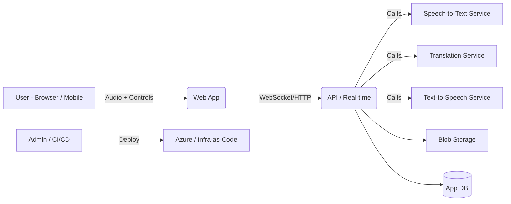
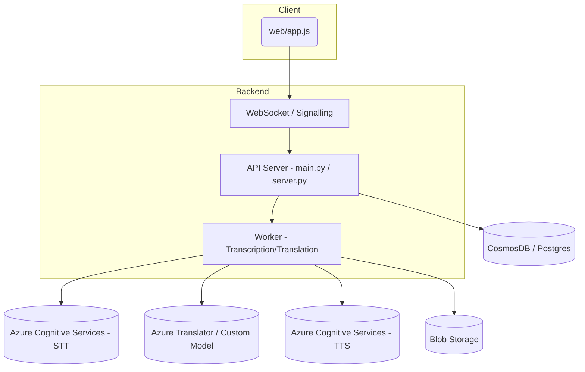
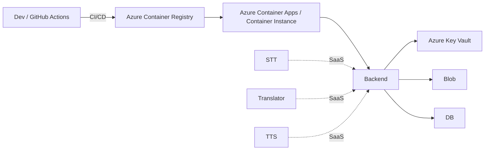
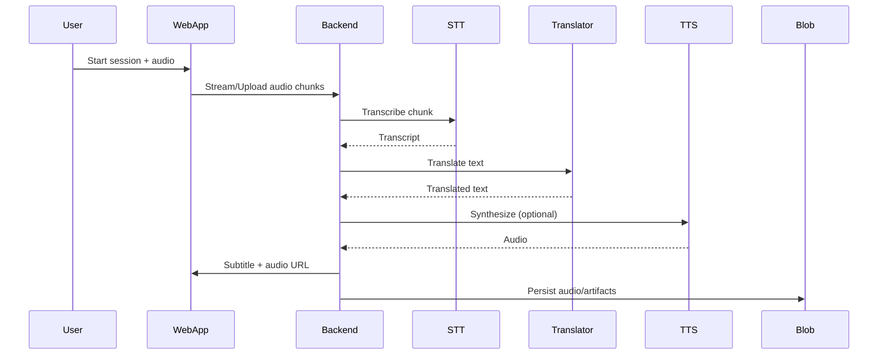

# Live Voice Translation - Architecture Plan

## Executive Summary
This document reviews the existing Live Voice Translation application and proposes architectural improvements focused on scalability, reliability, security, and maintainability. Diagrams use Mermaid syntax.

## System Context

Overview: Clients capture audio and send it to the backend which transcribes, translates and optionally synthesizes audio responses. The repo already contains `server.py`, `main.py`, a `Dockerfile`, `infra/` Bicep templates and a web client in `web/`.

## Architecture Overview
- Real-time ingestion (Web client) → Backend service handles streaming or chunked audio.
- Backend orchestrates STT → Translation → TTS and persists artifacts in Blob and metadata in a database.
- Infra-as-Code (Bicep) and deployment scripts support Azure-based deployment.

## Component Diagram

Responsibilities:
- `WebApp`: capture audio, show subtitles, playback translated audio.
- `API / Worker`: manage sessions, orchestrate services, store results.
- `Blob / DB`: store audio files and conversation metadata.

## Deployment Diagram

Notes: existing `infra/` contains `main.bicep` and container app bicep modules—good foundation. Use Key Vault for secrets and managed identities for service access.

## Data Flow

## Key Workflows / Sequence
- Real-time translation: low-latency path—prefer streaming STT and partial translations returned progressively.
- Batch mode: upload recorded audio, process asynchronously via queue/worker, notify client when complete.

## Recommendations & Improvements
- Low-latency path
  - Use WebRTC or low-latency WebSocket streaming to reduce round-trips. WebRTC often gives better jitter/latency for audio.
  - Prefer streaming STT APIs (Azure/Google) to get partial results for progressive translation.

- Scalability & Resilience
  - Decouple ingestion from processing with a durable queue (Azure Service Bus or Event Grid). This allows autoscaled workers.
  - Use stateless backend containers behind autoscale (Azure Container Apps/AKS) and scale workers separately.
  - Store audio blobs and metadata in Blob + CosmosDB/Postgres for fast queries.

- Security
  - Move all secrets to Azure Key Vault; use managed identities for resource access.
  - Enforce TLS, CSP on the web client, and validate CORS policies.
  - Add authentication/authorization (Azure AD / OAuth2) for users and admin endpoints.

- Observability
  - Instrument request traces (OpenTelemetry), metrics, and structured logs. Hook into Application Insights.
  - Add health probes and readiness checks for containerized services.

- Cost & Ops
  - For heavy transcription/translation loads consider batching and using regional model endpoints to reduce data egress.
  - Provide configurable quality/performance tiers (e.g., quick low-cost vs high-quality models).

## Non-Functional Requirements Considerations
- Scalability: queue + autoscaled workers, stateless API, horizontal scaling for Web/API.
- Performance: streaming STT, WebRTC option, regional endpoints, cache translations where appropriate.
- Reliability: retries with exponential backoff for external calls, dead-lettering for failed messages.
- Security: Key Vault, AAD, role-based access, secure deployments with least-privilege.
- Maintainability: separate components (API, worker, infra) with clear contracts and small surface area.

## Trade-offs
- Lower latency (WebRTC + streaming) increases complexity in the client and infra versus simple HTTP chunk uploads.
- Using managed SaaS STT/Translator speeds development but increases cost and external dependency.

## Risks & Mitigations
- Risk: variability in STT/translation quality across languages — Mitigate: provide fallbacks and configurable models.
- Risk: sensitive audio data leakage — Mitigate: encrypt at rest, use private networks and Key Vault, and purge artifacts by policy.

## Technology Stack Recommendations
- API & Worker: Python (existing code) or move to FastAPI + uvicorn for async streaming.
- Realtime: WebRTC for minimal latency; fallback WebSocket for compatibility.
- Infra: Continue using Bicep; use Managed Identities, Key Vault, and Container Registry.
- Storage: Azure Blob + CosmosDB/Postgres depending on query patterns.

## Next Steps
1. Confirm real-time requirements (latency vs cost vs complexity).
2. Decide streaming transport: WebSocket vs WebRTC.
3. Add queue and worker pattern for resilience and scale.
4. Implement Key Vault and Managed Identity integration (update `infra/`).
5. Add OpenTelemetry traces and Application Insights integration.

---
Generated by architecture review on repository root.
